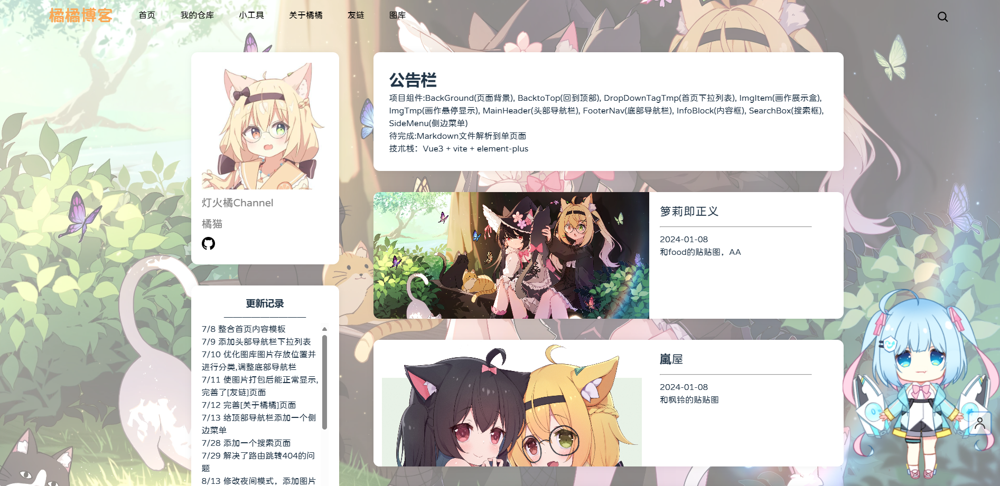

# 博客的前生今世

## **第一代**橘橘博客

使用html+css+js构建，[链接](https://nekoorangeblog.pages.dev/)

当初还没有博客的概念，只是单纯想做一个自己的网站。

受限于当初了解的知识，只有简单的功能

### 首页

一个NavBar，一个回到顶部的按钮，一个网易云复制的外链播放器，底部导航栏和后面的橘橘博客基本一致

### 友链

模仿B站样式做的友链页面，也添加了B站的链接和VRchat的主页链接

### 图库

简单的目录，点开后就是直接是很多图片

## 第二代橘橘博客

使用vue+vite+elemtment-plus构建，并且使用CICD自动构建并上传到阿里云OSS+CDN，[链接](https://blog.nekoorange.cn)

学了一个学期的Vue.js，可以使用vue创建自己的网站了。当初教的是vue2+cli，后面才自己接触了vue3+vite。`ps：vite启动比vue-cli快太多了。`第二代橘橘博客主要分为首页，仓库（计划用来放文章的），小工具（后面计划用来放各种网页工具的），关于橘橘（计划用来展示OC信息的），友链（展示好友网站链接），图库（展示约的稿子）这几大版块，同时还做了移动端的适配。 

> 图库页面，由vue的期末课设修改而来，当初模仿的是skeb的设计方案

::github{repo="LuoTianOrange/VueFinal-CourseDesign"}

> Live2D模型由`Live2dRender`组件驱动，模型取自毒霸姬

::github{repo="LSTM-Kirigaya/Live2dRender"}

### 首页

一个更好看的个人信息盒子，可以无限滚动的画作展示。

### 友链

没有怎么设计的友链

### 图库

可以折叠的画作分类展示，点进去可以展示画的详细信息，同时可以点击作者页面。

# 为什么使用Astro?

如果没有使用框架，也就意味着没有的功能就需要自己写（除非有人写了现成的包），受限于个人代码水平，很多想做的东西短时间内做不到。如果使用框架，如hexo这种，受限于框架的结构，又很难实现自己想要的功能。

Astro可以在博客框架的基础上，使用自己熟悉的语言编程，这是我使用Astro的一个理由。

# 为什么使用Fuwari主题？

因为之前使用hexo的时候发现了vivia主题，也就是现在的fuwari的前身，所以就继续使用了。

::github{repo="saicaca/hexo-theme-vivia"}

但是这个主题有些小问题，如一旦创建了带标签的文章，如果直接删除文章的话，标签会一直存在，除非到作为数据库的json里删除对应的字段才能删除对应标签。
