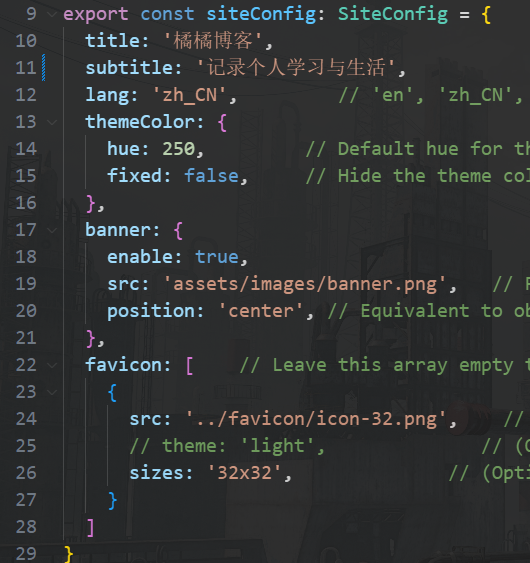

这篇文章记录了如何快速使用使用Fuwari创建个人博客的过程。

## 克隆项目

1.使用Fuwari模板仓库创建新的仓库。

::github{repo="saicaca/fuwari"}

2.创建好仓库后，使用Vscode将仓库克隆到本地。

3.运行 `pnpm install` 和 `pnpm add sharp` 安装依赖项。<br>

如果电脑上没有安装pnpm，则需要先运行`npm install -g pnpm`。

4.使用`npm run dev`启动项目，如果正常的话，现在已经可以看到页面。

## 修改配置

1.编辑配置文件 `src/config.ts` 以自定义博客内容

> siteConfig：包括了网站的标题，描述，主题色，头图和网站图标
>
> navBarConfig：网站顶部导航栏菜单内容，如果要添加新的站内跳转按钮需要调整`src\types\config.ts`的LinkPreset对象，`src\constants\link-presets.ts`的LinkPresets对象，同时需要在navBarConfig.link里添加对应的引用
>
> profileConfig：个人简介的资料，包括了头像，名字，个人链接
>
> licenseConfig：每篇文章下面会显示的许可信息，默认开启



2.修改配置文件`astro.config.mjs`确保编译后的路径是正确的

```typescript
export default defineConfig({
  site: "https://<你的github账号名字>.github.io",
  base: "/<你的仓库名字>",
  ...
})
```

3.在你的项目中的 `.github/workflows/` 目录创建一个新文件 `deploy.yml`，并粘贴以下 YAML 配置信息。

```yaml
name: Deploy to GitHub Pages

on:
  # 每次推送到 `main` 分支时触发这个“工作流程”
  # 如果你使用了别的分支名，请按需将 `main` 替换成你的分支名
  push:
    branches: [ main ]
  # 允许你在 GitHub 上的 Actions 标签中手动触发此“工作流程”
  workflow_dispatch:

# 允许 job 克隆 repo 并创建一个 page deployment
permissions:
  contents: read
  pages: write
  id-token: write

jobs:
  build:
    runs-on: ubuntu-latest
    steps:
      - name: Checkout your repository using git
        uses: actions/checkout@v4
      - name: Install, build, and upload your site
        uses: withastro/action@v2
        with:
          # path: . # 存储库中 Astro 项目的根位置。（可选）
          # node-version: 20 # 用于构建站点的特定 Node.js 版本，默认为 20。（可选）
          package-manager: pnpm@latest # 应使用哪个 Node.js 包管理器来安装依赖项和构建站点。会根据存储库中的 lockfile 自动检测。

  deploy:
    needs: build
    runs-on: ubuntu-latest
    environment:
      name: github-pages
      url: ${{ steps.deployment.outputs.page_url }}
    steps:
      - name: Deploy to GitHub Pages
        id: deployment
        uses: actions/deploy-pages@v4
```


## 部署项目

这里使用Github page部署，如果是使用其他方式部署项目请参考[链接](https://docs.astro.build/zh-cn/guides/deploy/)

1.完成以上工作后，在Gtihub仓库的设置页面`Page`选择`Github Actions`作为`Source`，保存。

2.在vscode提交并推送项目到Github

3.设置仓库的**visibility**为**public**

到这里，已经可以算完成个人博客的创建了。

你可以使用`pnpm new-post <name>`来创建新的文章
