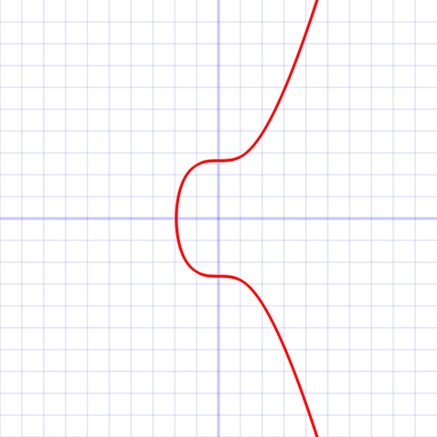
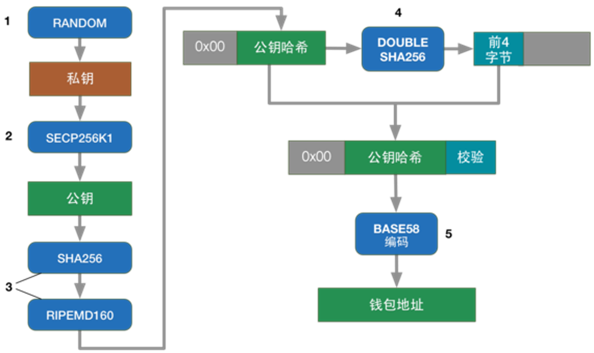
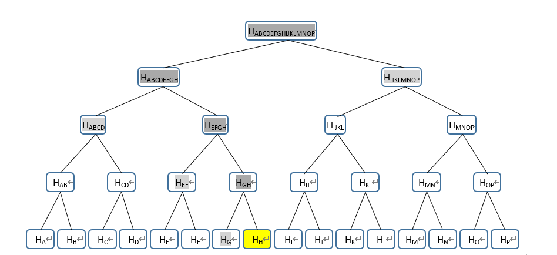
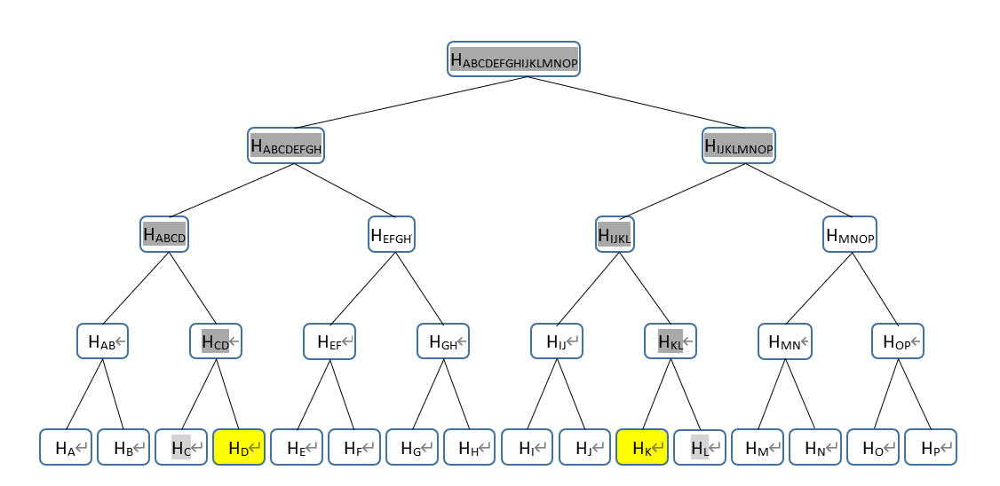

## 01 区块链简介

**2008**年，**中本聪**发表论文，描述了一种称为“**比特币**”的电子货币及其算法。

区块链是运用**密码学**与**共识机制**等技术建立，用于存储海量交易数据区块的**点对点**（P2P）网络系统。

区块链是一种安全共享的**去中心化**的数据账本。

去中心化：数据分散存放在整个网络的各个节点中。

### 去中心化优缺点

优点：

- 数据冗余度高，部分节点失效，不影响整个网络的数据；

- 自由度高，不受管理机构限制；

- 数据隐私性高。

缺点：

- 系统设计较为复杂。

区块:为把系统中的海量交易数据在网络中进行**分布式存储**，需要对数据进行分块，即区块。

链:虚拟的概念，不是指实际的指针或链式存储。**下一个**区块中的特定数据由**上一个**区块本身决定。因此下一个区块总是与上一个区块有关联，形成了虚拟的“链”。

共识机制:由于区块链网络中不存在中心权威服务器，为了让网络中的各个节点达成共识，需要设立共识机制。达成共识，是指网络中的各个节点都接受的某种操作。例如把一个新的区块加入到区块链中。

### 题目

> 1.【单选题】 （4分）
>
> 以下哪一项不属于区块链应用的优点？（ C ）。
>
> A.数据不可随意篡改，适合追踪或溯源。
>
> B.参与者都可以查看区块链中的信息，减少风险和欺诈。
>
> C.由一个组织来负责管理网络，控制谁被允许参与网络。
>
> D.具有分布式和加密的特性，攻击难度大。

## 02 比特币与区块链

比特币：一种基于**去中心化**，采用点对点网络与共识主动性，**开放源代码**，以区块链作为底层技术的**加密货币**，上限为2,100万个。

区块链：区块链是使用密码学方法产生的一串数据块（区块），**新增**的区块“链接”到上一个区块，即整条区块链的**尾部**。

挖矿：代表计算机节点通过大量的哈希运算，找到符合要求的Nonce值的过程

Prev Hash：前一区块的哈希值

Nonce：随机值，密码学中代表可能只使用一次的数字。

### 题目

> 6.【判断题】 （4分）
>
> 一个比特币账户对应一个密码，忘记密码无法使用账户中的比特币。（ 错 ）
>
> 对
>
> 错

> 9.【判断题】 （4分）
>
> 区块链使用了链表来存储金融交易数据。（ 错 ）
>
> 对
>
> 错

> 17.【填空题】 （每小题4分,共4分）
>
> 在区块链中，进行挖矿的基本单位称为<u>区块</u>。

> 21.【填空题】 （每小题4分,共4分）
>
> 最早广泛应用的区块链加密货币是<u>比特币</u>。

## 03 哈希算法

常见的哈希算法：MD5、**SHA-1**、**SHA-256**

设计要求：

- 确定性：相同的输入数据应得到相同的输出哈希值。

- 快速运算：哈希算法能快速计算出结果。

- **单向**性：不可逆，无法从哈希值反推出输入数据。

- 不可猜测：输入数据的微小变化会导致输出哈希值完全不同。

  

> **示例程序**：计算一段字符串数据的哈希值

主要方法列表：

`getInstance()`    可传入"MD5"、"SHA-1"、"SHA-256"；

`update()`       设置或添加输入数据；

`digest()`        计算哈希值。

`%02x`	转换为两位的十六进制数

```java
public class HashTest {
    public static void main(String[] args) throws NoSuchAlgorithmException {
        // 获取SHA-256消息摘要实例
        MessageDigest md = MessageDigest.getInstance("SHA-256");
        
        // 定义输入字符串
        String input = "Blockchain";
        
        // 将输入字符串转换为UTF-8字节数组并更新消息摘要
        md.update(input.getBytes(StandardCharsets.UTF_8));
        
        // 计算哈希值，返回字节数组
        byte[] output = md.digest();
        
        // 将字节数组转换为十六进制字符串
        StringBuilder hashString = new StringBuilder();
        for (byte b : output) {
            hashString.append(String.format("%02x", b));
        }
        
        // 输出十六进制字符串形式的哈希值
        System.out.println(hashString.toString());
    }
}

```

### 题目

> 24.【填空题】 （每小题4分,共4分）
>
> 哈希算法无法从输出值反推出输入值，这种特性称为<u>单向</u>性。

> 5.【单选题】 （4分）
>
> 挖矿操作是使用计算机进行（ C ）运算。
>
> A.点加法
>
> B.求模
>
> C.哈希
>
> D.标量乘法

> 6.【单选题】 （4分）
>
> 以下哪一项不属于哈希算法（ C ）
>
> A.MD5
>
> B.SHA-256
>
> C.AES
>
> D.RIPEMD-160

> 10.【判断题】 （4分）
>
> 哈希算法可以把输入数据缩短。（ 错 ）
>
> 对
>
> 错

## 04 SHA256算法解析

**S**ecure **H**ash **A**lgorithm，安全散列算法

- SHA-0：不安全
- SHA-1：曾广泛使用，现已不推荐使用，不安全
- SHA-2：**SHA-256**、SHA-512等
- SHA-3：全新设计

|  算法   | 消息  长度 | 分块  长度 | 操作  长度 | 输出  长度 |
| :-----: | :--------: | :--------: | :--------: | :--------: |
|  SHA-1  |    <264    |    512     |     32     | 160  bits  |
| SHA-256 |    <264    |    512     |     32     | 256  bits  |
| SHA-512 |   <2128    |    1024    |     64     | 512  bits  |

### 题目

> 3.SHA-256算法对消息进行处理时，需要对消息进行分块。分块的大小为（ D ）。
>
> A.64个二进制位
> B.256个二进制位
> C.448个二进制位
> D.512个二进制位

> 22.【填空题】 （每小题4分,共4分）
>
> 在SHA-256算法中，进行填充补位的目的是使处理后的消息长度为<u>512</u>位的倍数。

> 20.【填空题】 （每小题4分,共8分）
>
> 在比特币网络中，计算区块头哈希值所使用的哈希算法为<u>SHA-256</u>算法，其计算结果长度为个<u>32</u>字节。

> 3.【单选题】 （4分）
>
> SHA-256算法的输出长度为（ A ）
>
> A.256 bits
>
> B.256 bytes
>
> C.512 bits
>
> D.512 bytes

> 13.【判断题】 （4分）
>
> SHA-256算法比SHA-1更安全。（ 对 ）
>
> 对
>
> 错

> 22.【填空题】 （每小题4分,共4分）
>
> 在SHA-256算法中，进行填充补位的目的是使处理后的消息长度为<u>512</u>位的倍数。

## 05 SHA256算法实现

```java
package lab05;

import java.nio.ByteBuffer;
import java.nio.ByteOrder;
import java.util.Arrays;

public class Sha256 {
    // 64个常量，来源：自然数中前64个质数（2, 3, 5, 7, … , 283, 293, 307, 311）的立方根的小数部分的前32位。
    private static final int[] K = {
            0x428a2f98, 0x71374491, 0xb5c0fbcf, 0xe9b5dba5, 0x3956c25b, 0x59f111f1, 0x923f82a4, 0xab1c5ed5,
            0xd807aa98, 0x12835b01, 0x243185be, 0x550c7dc3, 0x72be5d74, 0x80deb1fe, 0x9bdc06a7, 0xc19bf174,
            0xe49b69c1, 0xefbe4786, 0x0fc19dc6, 0x240ca1cc, 0x2de92c6f, 0x4a7484aa, 0x5cb0a9dc, 0x76f988da,
            0x983e5152, 0xa831c66d, 0xb00327c8, 0xbf597fc7, 0xc6e00bf3, 0xd5a79147, 0x06ca6351, 0x14292967,
            0x27b70a85, 0x2e1b2138, 0x4d2c6dfc, 0x53380d13, 0x650a7354, 0x766a0abb, 0x81c2c92e, 0x92722c85,
            0xa2bfe8a1, 0xa81a664b, 0xc24b8b70, 0xc76c51a3, 0xd192e819, 0xd6990624, 0xf40e3585, 0x106aa070,
            0x19a4c116, 0x1e376c08, 0x2748774c, 0x34b0bcb5, 0x391c0cb3, 0x4ed8aa4a, 0x5b9cca4f, 0x682e6ff3,
            0x748f82ee, 0x78a5636f, 0x84c87814, 0x8cc70208, 0x90befffa, 0xa4506ceb, 0xbef9a3f7, 0xc67178f2
    };
    // 256位哈希值（32位*8）
    private static final int[] H = new int[8];
    // 消息处理顺序安排表
    private static final int[] W = new int[64];

    /**
     * 计算SHA256哈希值
     *
     * @param message 消息，字节数组
     * @return 哈希值，字节数组
     */
    public static byte[] hash(byte[] message) {
        // 工作变量
        int a, b, c, d, e, f, g, h, T1, T2;

        // 设置哈希初始值，来源：自然数中前8个质数（2, 3, 5, 7, 11, 13, 17, 19）的平方根的小数部分的前32位。
        H[0] = 0x6a09e667;
        H[1] = 0xbb67ae85;
        H[2] = 0x3c6ef372;
        H[3] = 0xa54ff53a;
        H[4] = 0x510e527f;
        H[5] = 0x9b05688c;
        H[6] = 0x1f83d9ab;
        H[7] = 0x5be0cd19;

        // 此处补全程序

    }

    // 可添加有需要的方法


    // 计算两次哈希值
    public static byte[] hashTwice(byte[] message) {
        // 此处补全程序
        return hash(hash(message));
    }

    // 以下为一系列用于转换的逻辑函数：

    // 选择：对于某个二进制位：x为1，选y值；x为0，选z值
    private static int ch(int x, int y, int z) {
        return (x & y) ^ (~x & z);
    }

    // 多数：对于某个二进制位：x,y,z中，两个或三个为1，结果才为1，否则结果为0
    private static int maj(int x, int y, int z) {
        return (x & y) ^ (x & z) ^ (y & z);
    }

    private static int bigSigma0(int x) {
        return Integer.rotateRight(x, 2) ^ Integer.rotateRight(x, 13) ^ Integer.rotateRight(x, 22);
    }

    private static int bigSigma1(int x) {
        return Integer.rotateRight(x, 6) ^ Integer.rotateRight(x, 11) ^ Integer.rotateRight(x, 25);
    }

    private static int smallSigma0(int x) {
        return Integer.rotateRight(x, 7) ^ Integer.rotateRight(x, 18) ^ (x >>> 3);
    }

    private static int smallSigma1(int x) {
        return Integer.rotateRight(x, 17) ^ Integer.rotateRight(x, 19) ^ (x >>> 10);
    }
}
```

## 06 非对称加密算法

非对称加密算法：加密和解密使用不同的密钥，密钥包括**公钥**和私钥，速度慢。

常用算法：RSA，椭圆曲线加密算法（ECC）

数字证书：由认证机构（CA）颁发，包含证书所有人的公钥等信息，由认证机构签名。

### 题目

> 5.以下哪一项属于非对称加密算法？（ C ）。
>
> A.MD5
> B.AES
> C.RSA
> D.DES

> 23.【填空题】 （每小题4分,共4分）
>
> 在非对称加密算法中，如使用私钥加密的数据，可使用<u>公钥</u>进行解密。

## 07 椭圆曲线加密算法

椭圆曲线加密算法: Elliptic Curve Cryptography（ECC），一种基于椭圆曲线数学的公开密钥加密算法。

椭圆曲线方程：y2=x3+ax+b

比特币选用的椭圆曲线：y2=x3+7 **a=0, b=7** secp256k1曲线



### 题目

> 6.比特币使用的椭圆曲线名称为（ B ）。
>
> A.secp224k1
> B.secp256k1
> C.secp256r1
> D.secp384r1

> 17.【填空题】 （每小题4分,共8分）
>
> 椭圆曲线的方程为y2=x3+ax+b。比特币所使用的椭圆曲线其中a = <u>0</u>，b = <u>7</u> 。

> 19.【填空题】 （每小题4分,共4分）
>
> 椭圆曲线数字签名算法的英文缩写为<u>ECDSA</u>。

> 4.【单选题】 （4分）
>
> 以下关于非对称加密算法的描述，哪一项是不正确的？（ B ）
>
> A.使用公钥和私钥。
>
> B.加密速度快。
>
> C.可用于身份认证。
>
> D.可保证不可否认性。

> 11.【判断题】 （4分）
>
> 椭圆曲线加密算法属于非对称加密算法。（ 错 ）
>
> 对
>
> 错

> 14.【判断题】 （4分）
>
> 与RSA算法相比，椭圆曲线加密算法使用更长的密钥，以保证相同等级的安全性。（ 错 ）
>
> 对
>
> 错

## 08 数字签名

应用需求：身份认证，不可否认性

数字签名：又称公钥数字签名，是只有信息的发送者才能产生的别人无法伪造的一段数字串。

一套数字签名通常定义两种互补的运算，一个用于签名，另一个用于验证。

> 椭圆曲线数字签名算法：Elliptic Curve Digital Signature Algorithm，**ECDSA**
>
> 已知椭圆曲线上的点G和K，满足kG=K，k为大整数。由G和K**推导出k值，难度相当大。**

### ECDSA签名与验证

设基点为G，私钥为k，公钥为K，满足kG=K。

发送者使用私钥签名：
1、选择随机数r，计算点rG(x, y)。
2、根据随机数r、消息M的哈希h、私钥k，计算s = (h + kx)/r。
3、将消息M、和签名{rG, s}发给接收方。
接收者使用公钥验证签名：
1、接收方收到消息M、以及签名{rG=(x,y), s}。　
2、根据消息求哈希h。
3、使用发送方公钥K计算：hG/s + xK/s，并与rG比较，如相等即验签成功。

签名时，有：
s = (h + kx)/r
验证时，计算：
hG/s + xK/s 
= hG/s + x(kG)/s 
= (h+xk)G/s　　
= r(h+xk)G / (h+kx) 
= rG

> 以下是使用JDK相关的类，实现椭圆曲线数字签名和验证的示例程序

```java
public class ECDSATest {
    public static void main(String[] args) throws Exception {
        // 创建椭圆曲线参数规范对象，指定使用secp256r1曲线
        ECGenParameterSpec ecSpec = new ECGenParameterSpec("secp256r1");
        
        // 获取椭圆曲线密钥对生成器实例
        KeyPairGenerator gen = KeyPairGenerator.getInstance("EC");
        
        // 初始化密钥对生成器，使用安全随机数生成器
        gen.initialize(ecSpec, new SecureRandom());
        
        // 生成密钥对（包含私钥和公钥）
        KeyPair keypair = gen.generateKeyPair();
        PrivateKey privateKey = keypair.getPrivate();
        PublicKey publicKey = keypair.getPublic();

        // 要签名的消息
        String message = "I have sent you one bitcoin";
        
        // 获取ECDSA签名对象，使用SHA-256进行哈希
        Signature ecdsaSign = Signature.getInstance("SHA256withECDSA");
        
        // 用私钥初始化签名对象
        ecdsaSign.initSign(privateKey);
        
        // 更新签名对象，传入要签名的消息
        ecdsaSign.update(message.getBytes(StandardCharsets.UTF_8));
        
        // 生成签名
        byte[] signature = ecdsaSign.sign();
        
        // 用公钥初始化签名验证对象
        ecdsaSign.initVerify(publicKey);
        
        // 更新签名验证对象，传入要验证的消息
        ecdsaSign.update(message.getBytes(StandardCharsets.UTF_8));
        
        // 验证签名并输出结果
        if (ecdsaSign.verify(signature)) {
            System.out.println("验证成功。");
        } else {
            System.out.println("验证失败。");
        }
    }
}

```

### 题目

> 2.【单选题】 （4分）
>
> 以下哪一项不属于数字签名算法可保证的范畴？（ A ）
>
> A.机密性
>
> B.完整性
>
> C.身份认证
>
> D.不可否认性

> 以下哪一项是数字签名可以解决的问题？（ B ）。
>
> A.数据的压缩
> B.交易的不可否认
> C.交易数据的传输
> D.数据的保密

> 15.【判断题】 （4分）
>
> 对信息进行数字签名时，使用的是公钥。（ 错 ）
>
> 对
>
> 错

> 19.【填空题】 （每小题4分,共4分）
>
> 椭圆曲线数字签名算法的英文缩写为<u>ECDSA</u>。

## 09 账户地址生成算法

使用<u>**4**</u>次`SHA-256`算法

第一次使用`SHA-256`算法，第二次使用`RIPEMD-160`算法。

为使方便检测账户地址是否有输入错误，地址中添加了校验值。使用两次`SHA-256`算法。

原始地址结果为二进制（字节数组），为方便阅读和抄写，地址会转换为`Base58`编码。



> 地址生成示例
>
> 1. 随机选取一个32字节的数，作为私钥。
> 2. 使用椭圆曲线加密算法计算私钥所对应的非压缩公钥（共65字节，1字节0x04，32字节为x坐标，32字节为y坐标）。
> 3. 计算公钥的SHA-256哈希值。
> 4. 计算上一步哈希值的RIPEMD-160哈希值。
> 5. 在上一步结果之前加入地址版本号
> 6. 计算上一步结果的SHA-256哈希值。
> 7. 再次计算上一步结果的SHA-256哈希值。
> 8. 取上一步结果的前4个字节,把这4个字节加在第五步结果的后面，作为校验值
> 9. 对上一步结果进行Base58编码。

`RIPEMD-160`算法：安全性没有SHA-256算法高，但**输出长度更短**。

`Base58`编码：使用58进制转换大整数。共使用**58**个字符。相比Base64，Base58不使用容易混淆的字符：数字"0"，大写字母"O"，大写字母"I"和小写字母"l"，以及"+"和"/"符号。

### 题目

> 4.【单选题】 （4分）
>
> 接收比特币的账户地址由（ C ）产生。
>
> A.银行账号
>
> B.邮箱地址
>
> C.交易方的公钥
>
> D.安全的随机数

> 22.【填空题】 （每小题4分,共4分）
>
> 为了方便普通用户识别和复制，比特币的地址采用了<u>BASE58</u>编码。

> 8.【单选题】 （4分）
>
> 以下哪一项与比特币的地址无关？（ D ）
>
> A.私钥
>
> B.公钥
>
> C.SHA-256算法
>
> D.Base64编码

## 10 UTXO模型

一个**交易**（Transaction，Tx）是一组数据，用于表示比特币的转移。

一个普通交易接收一个或多个输入，创建一个或多个输出。

特殊情况：**币基（coinbase）交易没有输入，**只有输出。

**输入**（TxIn）：**来源**于之前交易的输出。

输出（TxOut）：新创建，表示比特币的**转移目标**。

### UTXO模型

**未使用的交易输出**（unspent transaction output）

交易输出分为**已使用**的和**未使用**的。

只有未使用的交易输出才可以作为新创建的交易的输入。

挖矿结点会对每个输入进行验证，以确定其来自于未使用的输出，以避免“双花”交易，即同一笔钱花了两次。

同一地址的所有UTXO总和即为该地址的比特币余额。

输入总和大于输出总和，两者差额为**手续费**

### 题目

> (1)   以下是某一时间点的各个交易的状态。请根据现有的交易和UTXO模型计算A、B、C各地址的余额。
>
> | 交易 1            |      |      |      |
> | :---------------- | ---- | ---- | ---- |
> | 输入              | 输出 |      |      |
> | 不包含A、B、C地址 | 序号 | 地址 | 值   |
> |                   | 0    | A    | 20   |
> |                   | 1    | B    | 30   |
> |                   | 2    | C    | 10   |
>
> | 交易 2       |      |      |      |
> | :----------- | ---- | ---- | ---- |
> | 输入         | 输出 |      |      |
> | 交易1，序号1 | 序号 | 地址 | 值   |
> |              | 0    | A    | 8    |
> |              | 1    | B    | 9    |
> |              | 2    | C    | 12   |
>
> | 交易 3       |      |      |      |
> | :----------- | ---- | ---- | ---- |
> | 输入         | 输出 |      |      |
> | 交易2，序号1 | 序号 | 地址 | 值   |
> | 交易2，序号2 | 0    | A    | 10   |
> |              | 1    | B    | 8    |
> |              | 2    | C    | 2    |
>
> A=20+8+10=38 
>
> B=30-30+9-9+8=8 
>
> C=10+12-12+2=12

> 计算比特币账户余额，需要使用以下哪一项的信息？（ C ）。
>
> A.Input
>
> B.私钥
>
> C.UTXO
>
> D.Balance

> 25.【填空题】 （每小题4分,共4分）
>
> 同一比特币账户地址的所有未使用的交易 <u>输出</u> 的总和，即为该账户地址的比特币余额。

## 11 默克尔树

全节点：保存完整的区块链数据，包含**区块头**和**区块体**。

轻节点：只保存区块头以及与自己相关的交易数据。只有部分数据，需借助全节点完成交易验证。

默克尔树：是一棵**二叉树**，所有叶子结点分别为本区块的**所有交易的哈希值**；

- 除了叶子结点之外，还包含父结点，其值定义为：
- 如果有右孩子，则父结点值为**左孩子**和**右孩子**拼接结果的哈希值；
- 如果没有右孩子，则父结点值为**左孩子**和**左孩子**拼接结果的哈希值；
- 默克尔树的根结点称为**默克尔根**，记录在区块头。

### 默克尔树的用途

- 使用全部交易数据，通过构造默克尔树，得到默克尔根之后，可对交易的存在性进行快速验证。
- 验证某个交易是否存在于某个区块时，无需重新获取全部交易数据，只需部分交易数据，即可进行验证。
- 如果区块中某个交易被篡改，则默克尔根也会变化。
- 由于默克尔根在区块头中，已在挖矿过程中由多个网络节点确认，因此伪造默克尔根难度极大。

### 题目

> (1)   以下是一棵默克尔树。如果要验证交易H的存在性，请列出需要查询的默克尔树结点，并说明验证方法。
>
> 
>
> H(H)+H(G)→H(GH)
>
> H(EF)+H(GH)→H(EFGH)
>
> H(ABCD)+H(EFGH)→H(ABCDEFGH)
>
> H(ABCDEFGH)+H(IJKLMNOP)→H(ABCDEFGHIJKLMNOP)

> (2)   以下是一棵默克尔树。如果要验证交易D和交易K的存在性，请列出需要查询的默克尔树结点，并说明验证方法。
>
> 
>
> H(D)+H(C)=H(CD)
>
> H(CD)+H(AB)=H(ABCD)
>
> H(ABCD)+H(EFGH)=H(ABCDEFGH)
>
> H(K)+H(L)=H(KL)
>
> H(KL)+H(IJ)=H(IJKL)
>
> H(IJKL)+H(MNOP)=H(IJKLMNOP)
>
> H(ABCDEFGH)+H(IJKLMNOP)=H(ABCDEFGHIJKLMNOP)

> (3)   假设一个区块中总共包含2048个交易，轻节点为了验证其中1个交易是否在此区块中，需要向全结点查询多少个结点值才能完成验证？
>
> 2^(i-1)=2048 i=12 h=12 12-1=11
>
> 需要查询11个节点值

> 10.【单选题】 （4分）
>
> 以下关于默克尔树的描述中，不正确的是（ A ）。
>
> A.默克尔树的叶子结点数可以是奇数或偶数。
>
> B.构造默克尔树时使用了哈希算法。
>
> C.默克尔树减少了网络节点对于交易数据的存储量。
>
> D.默克尔根存储于区块头中。

> 12.【判断题】 （4分）
>
> 在区块链中，每个区块保存一条交易数据。（ 错 ）
>
> 对
>
> 错

## 12 分布式系统与共识机制

分布式系统的特点：分布于不同的地理位置，并行化处理，可靠性，可用性

Paxos算法：在一个可能发生以上异常的分布式系统中，快速且正确地在集群内部对某个数据的值达成一致，并且保证不论发生以上任何异常，都不会破坏整个系统的一致性。不包括消息被篡改的异常。

共识机制：由计算机算法和协议构成，满足以下条件

一致性：所有好节点的决策值必定相同；

可终止性：所有好节点在有限时间内结束决策过程；

有效性：选择出的决策值必须是某个节点的输入值

常见的共识算法：**工作量证明**（PoW），**权益证明**（PoS），**实用拜占庭容错**（PBFT）

### 题目

> (a)    区块链中，使用共识算法的原因是什么？
>
> 因为区块链具有去中心化的特点，需要网络的各个计算机节点一起进行决策，所以需要使用共识算法
>
> (b)    共识机制由哪些方面构成？
>
> 共识机制由计算机算法和协议构成。
>
> (c)    比特币网络中，如果计算机节点想把自己生成的区块添加到主链中，需要达到什么条件？
>
> 需要经过共识机制对区块确认，即得到其他计算机节点的认可。

> 11.【单选题】 （4分）
>
> 以下关于分布式系统的描述中，不正确的是（ C ）
>
> A.分布式系统在不同的机器节点保存数据。
>
> B.分布式系统运行在多个地理位置。
>
> C.分布式系统中的一台机器节点出现崩溃，将导致其他节点不能正常运行。
>
> D.分布式系统上的各个机器节点需要取得共识。

## 13 PoW工作量证明

`Proof-of-Work，PoW`

工作量证明的过程中，需要**耗费大量**的计算机设备**资源**和电力资源。

工作量证明的特点：

- 计算满足工作量要求的哈希值**很困难**，只能穷举区块头中的Nonce值，没有更好的方法，因此需要消耗大量计算资源。
- 如果**已知Nonce值**，则其他节点**很容易**验证区块是否满足工作量要求。

### 区块头中的nBits

nBits占32位，**4个字节**，其值相当于256版本的科学计数法。

| **内容**                   | **说明**                         |
| :------------------------- | :------------------------------- |
| version                    | 版本，表示验证规则               |
| previous block header hash | 前一区块头的哈希                 |
| merkle  root hash          | 默克尔根，与本区块的所有交易相关 |
| time                       | 时间戳                           |
| **nBits**                  | **目标值，表示难度**             |
| nonce                      | 随机值                           |

比特币网络设定大约**10分钟**产生一个新区块。

原因：网络需要足够的时间同步数据。如果难度太小，较少时间就能产生区块，也会导致区块链出现多个分叉。算力增加，需要加大难度，才能按设定10分钟产生一个区块。如果算力减少，则需要减小难度。

### 工作量证明的优缺点

优点：

- 切实可行，比特币网络已正常运行多年。
- 能够实现完全的“**去中心化**”，将记账权公平的分派到其他节点。
- **安全性高**，破坏系统需要投入极大的成本。

缺点：

- “挖矿”需要进行大量无实际意义的计算，造成较多的**计算资源和电力资源浪费**。
- **网络性能较低**，需要等待多个确认。

### 题目

> 12.【单选题】 （4分）
>
> 比特币网络节点使用的共识算法是（ A ）
>
> A.PoW
>
> B.PoS
>
> C.BFT
>
> D.PBFT

## 14 PoS权益证明

`Proof-of-Stake，PoS`

以太坊网络预计未来将使用的共识机制/算法。

为了解决PoW工作量证明共识机制会消耗大量资源的缺点，提出的确认记账权的共识算法。

Stake（抵押物，权益）

### 算法描述

- 记账节点预付抵押物，以代表其权益。
- 算法随机选择符合条件的挖矿节点。
- 挖矿时，节点的抵押物越多，即持币越多，其需要计算的目标值越大，难度越小，越容易挖矿成功。
- 同时，也引入持币时间，持币时间越长，挖矿难度也越小。
- 挖矿成功时，将给予一定的奖励，并重新计算持币时间，以保证公平性。

### 权益证明的优缺点

优点：

- 在一定程度上**缩短了**共识达成的**时间**。
- 不再需要**大量**消耗能源挖矿。

缺点：

- 未经过长期运行以验证其稳定性。
- 无法完全避免**挖矿**。
- 极端的情况下会带来**中心化**的结果。

|      | PoW工作量证明                                                | PoS权益证明                                                  |
| ---- | ------------------------------------------------------------ | ------------------------------------------------------------ |
| 优点 | 1.切实可行，比特币网络已正常运行多年。  2.能够实现完全的“去中心化”，将记账权公平的分派到其他节点。  3.安全性高，破坏系统需要投入极大的成本。 | 1.在一定程度上缩短了共识达成的时间。  2.不再需要大量消耗能源挖矿。 |
| 缺点 | 1.“挖矿”需要进行大量无实际意义的计算，造成较多的计算资源和电力资源浪费。  2.网络性能较低，需要等待多个确认。 | 1.未经过长期运行以验证其稳定性。  2.无法完全避免挖矿。  3.极端的情况下会带来中心化的结果。 |

### 题目

> 13.【单选题】 （4分）
>
> 与持币数量相关的共识算法是（ B ）。
>
> A.PoW
>
> B.PoS
>
> C.BFT
>
> D.PBFT

## 15 PBFT实用拜占庭容错

### 算法描述

1.客户端发一个请求给主节点去执行某个操作；

2.主节点广播这个请求到各个副本节点；

3.包括主节点在内的所有副本节点在收到准备消息之后，对消息进行验证，确认信息无误后，执行操作，并把结果返回给客户端；

4.结果反馈：当客户端收到 f +1 个来自不同节点的相同的结果后，过程结束。f 为故障节点数目。

只要客户端能保证多数人认可同一个结果，那么这个结果就是最终的共识。

### 实用拜占庭容错算法的优缺点

优点：

- 高效：交易无需等待确认。各个节点达成共识是在同一时刻决定的，不容易出现分叉。
- 节能：**无需挖矿**，不会耗费大量电能。

缺点：

- 由于每个副本节点都需要和其它节点进行共识同步不适用于节点数量过大的区块链。
- 系统节点是固定的，无法应对公有链的开放环境，只适用于**联盟链或私有链**环境。
- 要求总节点数 n≥3f+1，系统的失效节点数量不得超过全网节点的1/3，容错率相对较低。

| PBFT实用拜占庭容错                                       | PoW工作量证明                                  |
| -------------------------------------------------------- | ---------------------------------------------- |
| 高吞吐量和低延迟， 能耗低， 确定性共识，  适应小规模网络 | 高安全性，去中心化，简单易实现，抗女巫攻击     |
| 扩展性差，节点信任问题，复杂的协议实现                   | 高能耗，低吞吐量和高延迟，资源浪费，集中化风险 |

## 16 以太坊

Ethereum，一个去中心化的、开源的，并且具备**智能合约**功能的**公共区块链**平台。

**以太币**（ETH）是以太坊的**原生加密货币**。

以太币是市值**第二高**的加密货币，仅次于比特币。

比特币网络只有一种代币：比特币。以太坊可由用户自定义代币，代表数字货币、物品所有权等。

### 智能合约

智能合约，指存储在区块链上的**一段可执行的程序代码**，丰富了区块链的应用功能。

智能合约可使用`Solidity`语言编写，语法类似于JavaScript。

智能合约**一旦创建**就**无法更改**，保证按照其代码定义的规则执行。

智能合约运行在以太坊上，通过密码学算法保证安全的流程，使交易和商业功能可在不需要可信中介的情况下进行。

### 以太坊的共识机制

以太坊建立时，使用的共识机制为**工作量证明**（PoW）。

2022年9月15日，以太坊在称为“合并”的升级过程中，将其共识机制从工作量证明（PoW）过渡到**权益证明**（PoS）。

切换到权益证明后，以太坊的能源使用量**减少了99%**。

避免了在工作量证明中，因出现算力强大的“矿机”而导致的**中心化**。

### 题目

> 9.【单选题】 （4分）
>
> 以太坊使用的共识算法是（ C ）。
>
> A.PoW
>
> B.PoS
>
> C.PoW和PoS
>
> D.PBFT

> 14.【单选题】 （4分）
>
> 以下关于以太坊的描述中，哪一项是不正确的？（ A ）。
>
> A.以太坊属于私有链。
>
> B.以太坊的原生加密货币是以太币。
>
> C.以太坊具有智能合约。
>
> D.可使用Solidity语言在以太坊中进行开发。
