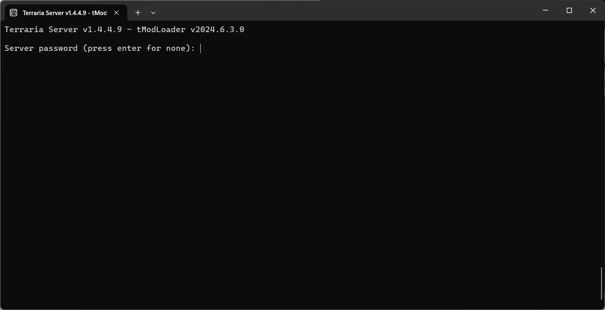
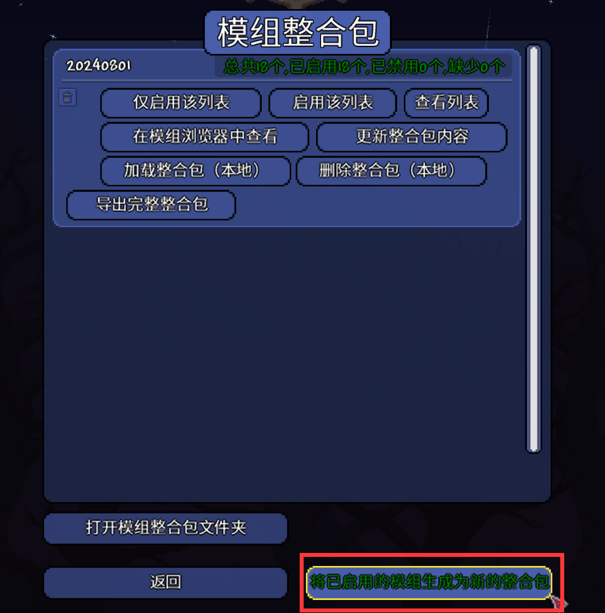

## 引言

> 假期有人要一起开荒泰拉瑞亚灾厄，刚开始我们使用的是steam的服务器，即直接在游戏内使用“开服并开启游戏”，但是这样有几个缺点：人数多起来就会变卡，主机一退出大家都玩不了了，个别网络的用户可能连接不上。

本教程基于Windows和tModloader v2024.6.4.0，Linux版本的请参考[在Linux上搭建tModLoader服务器](https://www.bilibili.com/read/cv26637736/)

为了解决这样的问题，我们需要使用tmodloader的`start-tModLoaderServer.bat`来启动服务器。

## 配置环境

确保服务器上已经安装了`.NET`，如果没有安装，可以[点击这里](https://dotnet.microsoft.com/zh-cn/download/dotnet/thank-you/sdk-8.0.303-windows-x64-installer)下载

如果已经安装了，可以进入下一步。

## 开服

### 在自己电脑上开服

双击`start-tModLoaderServer.bat`，启动服务器

Use steam server（使用steam服务器？），输入n，然后按回车键

等待一段时间后，会列出本地的地图

输入`数字`是选择开服使用的地图，输入`n`是创建新的世界，输入`d+数字`是删除世界，输入`m`是查看mod列表

这里我们选择一个创建好的地图，并按下回车键

然后会让我们选择最大人数，输入一个`1-16`的数字即可，如果不想设置，直接按回车就是默认最大16人。

然后就是设置服务器端口，默认是`7777`，可以不用调，按回车键进入下一步

自动转发端口，输入`y`，按回车键进入下一步

设置服务器密码，最好还是设置一个，如果不想设置可以直接按回车键

然后就完成开服了

如果想让别的朋友连上你的服务器的话，可能需要一些内网穿透的工具（没有公网的情况）

### 在服务器上开服

服务器比本地开服多一步，需要手动把mod放到服务器上。

首先我们需要点开创意工坊->模组整合包，导出mod和mod配置

然后点击`将已启用的模组生存为新的整合包`

输入一个自己喜欢的名字，只能是英文和数字，中文和字符不行

然后点击`打开模组整合包文件夹`，将打包好的`Mods`文件夹和`ModConfigs`文件夹复制到服务器上的`%USERPROFILE%\Documents\My Games\Terraria\tModLoader`文件夹内(默认位于C盘)

如果需要将本地存档放到服务器上，直接放入`tModloader\Worlds`内即可

剩下的步骤和在自己电脑开服一致

